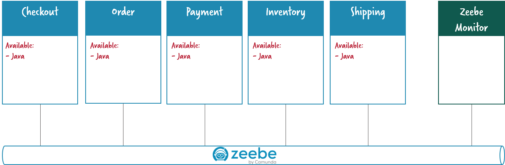
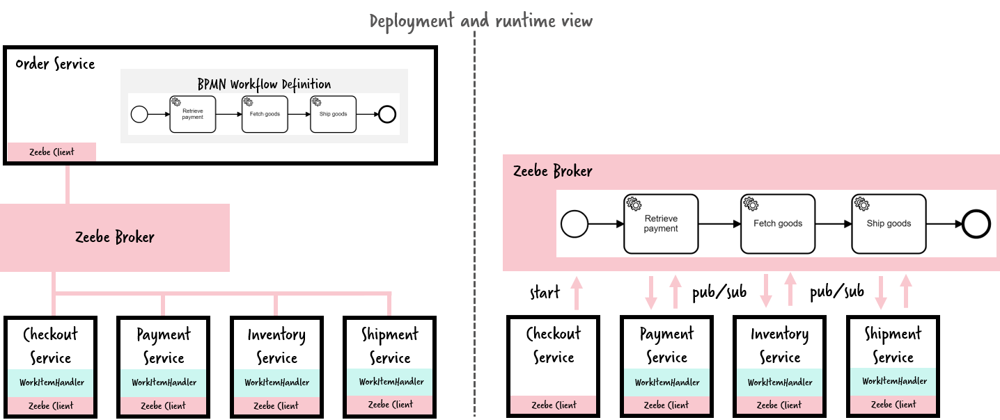
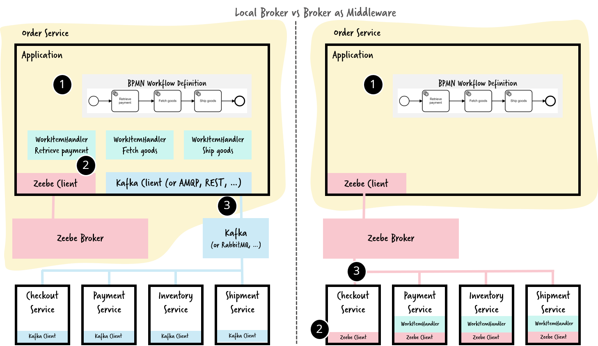

# Flowing Retail / Zeebe / Java

This folder contains services written in Java that leverage the horizontally scalable workflow engine Zeebe for work distribution and as means of communication.

Tech stack:

 * Java 8
 * Spring Boot 1.5.x
 * Spring Cloud Streams
 * Zeebe

 Following you can see a diagram with all the services we'll to use.



One important aspect on this design is that Zeebe is used as central middleware. By doing so you do not need any messaging system like Apache Kafka or RabbitMQ.

This might feel unusal for you, but we do know of quite some projects going into this direction for various reasons. We discuss the differences of the alternatives below.

In order to use Zeebe as orchestrator a workflow model describing the orchestration is deployed from the order service onto the broker. The services then subscribe to work items of that workflow. Zeebe publishes the work and streams it to the corresponding clients:



Note that the workflow model is owned by the Order Service and deployed from there onto the broker automatically, e.g. during startup of the service. The broker then versions it and runs it.

Now Zeebe is the only common denominator. For every service you can decide for **programming language**.

## Does Zeebe complement or replace middleware?

In the above example I replaced Apache Kafka by Zeebe.

The decision between both architecture alternatives is a very interessting one. The following picture visualizes the difference:



As always it depends on the circumstences which architecture might work in your scenario:

 * If your motivation is to use Zeebe as **Saga Coordinator** than it is very natural to run a central broker, as this can sort out all consistency behavior of your Sagas for you.
 * If you **orchestrate your microservices** you might want to follow the [Smart Endpoints and Dumb pipes](https://martinfowler.com/articles/microservices.html#SmartEndpointsAndDumbPipes) approach from Martin Fowler. This would mean to have e.g. Apache Kafka as dumb pipe and put all the smartness into the services, e.g. the worklow executed within Zeebe.

So there are a couple of **advantages** of using Zeebe as middleware:

 * Less code involved
 * No need to operate an own messaging system or event bus
 * Operations tooling from the workflow engine can be used

Of course there are also **downsides**:

 * Dependency to Zeebe in a lot of components (the places where you had a Kafka dependency before)
 * Requires confidence on Zeebe to play that central role and take the load.

Depending on your choice the workflow model might look a bit different and e.g. the data flow and data mapping might be different (e.g. data mapping in the workflow model instead of the WorkItemHandler).

## Fast run

To execute all the services with all the configuration by default, just execute the following command.

```
 $ make run
```

Once all the services are up and running, you can access to the following URL's:

 * If you want to simulate a new order `Order` [http://localhost:8090](http://localhost:8090)
 * Camunda webapp for the service `Order` [http://localhost:8091](http://localhost:8091)
 * Camunda webapp for the service `Payment` [http://localhost:8092](http://localhost:8092)
 * You can monitor all the system events in  [http://localhost:8095](http://localhost:8095)

To access to the Camunda webapp in the `Order` and `Payment` services, you can user the following credentials:

 * user: `demo`
 * password: `demo`

## More help

If you need more help, you just have to execute the following command:

```
 $ make
```

## Referencias

 * https://blog.bernd-ruecker.com/flowing-retail-demonstrating-aspects-of-microservices-events-and-their-flow-with-concrete-source-7f3abdd40e53
 * https://blog.couchbase.com/saga-pattern-implement-business-transactions-using-microservices-part/
 * https://blog.couchbase.com/saga-pattern-implement-business-transactions-using-microservices-part-2/
